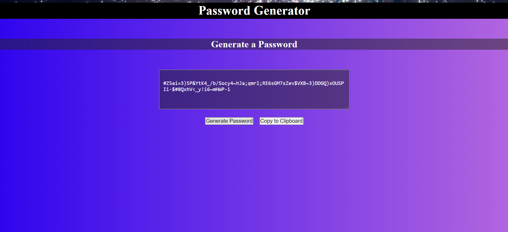

# Password Generator

https://spacedel.github.io/Password-Generator/

## Screenshot

## Overview

The purpose of this is to create a password generator using the 4 character types: uppercase, lowercase, numbers and symbols.

The user is asked how many characters they would like and confirm whether you would want to use all 4 types or just a few. You would then press the generate password button to create a password of that length. The copy to clip board button then copies the generated password.

## User Story

* As a user, I want to be able to generate a password following specific criteria and copy it to a clipboard.

# Info / Questions

* [Devonte Letts](https:/github.com/spacedel)
